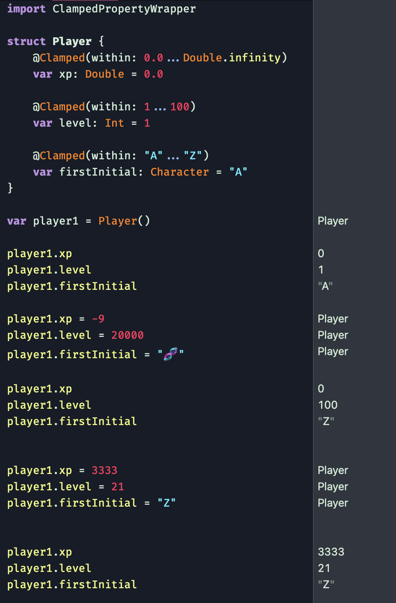

# Clamped: A Swift Property Wrapper

<!-- Header Logo -->

<!-- <div align="center">
   
</div> -->


<!-- Badges -->

<p>
    
    
    
    
    
    
    
    <a href="https://github.com/apple/swift-package-manager">
      
    </a>
    <a href="https://twitter.com/cypher_poet">
        
    </a>
</p>


<p align="center">

_A [Swift Property Wrapper](https://docs.swift.org/swift-book/LanguageGuide/Properties.html#ID617) for automatically clamping Comparable values within a closed range._

<p />


## Installation

### Xcode Projects

Select `File` -> `Swift Packages` -> `Add Package Dependency` and enter `https://github.com/CypherPoet/ClampedPropertyWrapper`.


### Swift Package Manager Projects

You can add `ClampedPropertyWrapper` as a package dependency in your `Package.swift` file:

```swift
let package = Package(
    //...
    dependencies: [
        .package(url: "https://github.com/CypherPoet/ClampedPropertyWrapper", .upToNextMajor(from: "0.1.0")),
    ],
    //...
)
```

From there, refer to `ClampedPropertyWrapper` as a "target dependency" in any of _your_ package's targets that need it.

```swift
targets: [
    .target(
        name: "YourLibrary",
        dependencies: [
          "ClampedPropertyWrapper",
        ],
        ...
    ),
    ...
]
```

Then simply `import ClampedPropertyWrapper` wherever you’d like to use it.


## Usage

**Basic Example**:

```swift
import ClampedPropertyWrapper

struct Player {
    @Clamped(within: 0.0...Double.infinity)
    var xp: Double = 0.0

    @Clamped(within: 1...100)
    var level: Int = 1

    @Clamped(within: "A"..."Z")
    var firstInitial: Character = "A"
}
```

**Taking it a bit further in [this project's Xcode Playground](./Examples/Playgrounds/)**:



## Contributing

Contributions to `ClampedPropertyWrapper` are most welcome. Check out some of the [issue templates](./.github/ISSUE_TEMPLATE/) for more info.


## 💻 Developing

### Requirements

- Xcode 12.5+ (Recommended)


### 📜 Generating Documentation

Documentation is generated by [Jazzy](https://github.com/realm/jazzy). Installation instructions can be found [here](https://github.com/realm/jazzy#installation), and as soon as you have it set up, docs can be generated simply by running `jazzy` from the command line.

📝 Note that this will only generate the `docs` folder for you to view locally. This folder is being ignored by `git`, as an [action](./.github/workflows/PublishDocumentation.yml) exists to automatically generate docs at the root level and serve them on the project's `gh-pages` branch.


## 🏷 License

`ClampedPropertyWrapper` is available under the MIT license. See the [LICENSE file](./LICENSE) for more info.
